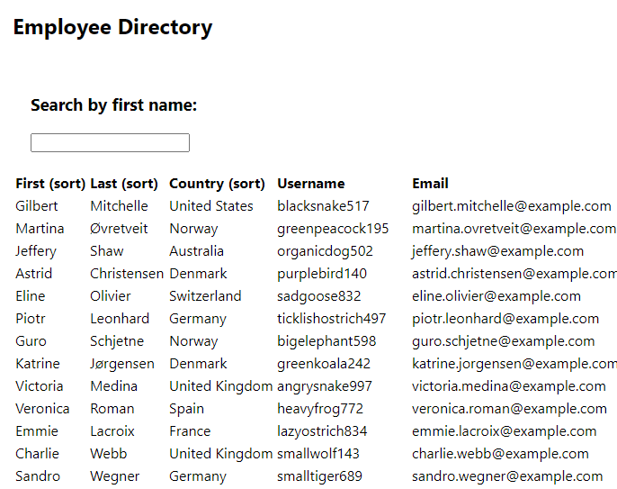

# Employee Directory
## Description
This application allows company managers to view employee information including first and last names, their location country, username, and email address. Employees are displayed in a table which can be sorted by first name, last name, or country and filtered by first name.
## Instructions
In order to filter by first name, type in the search box at the top, and the app will dynamically update the table. If you would like to sort by first name, last name, or country, simply click on those column headings to sort in descending order. 

[GitHub Pages Deployment](https://matthale11.github.io/employee-directory/)

